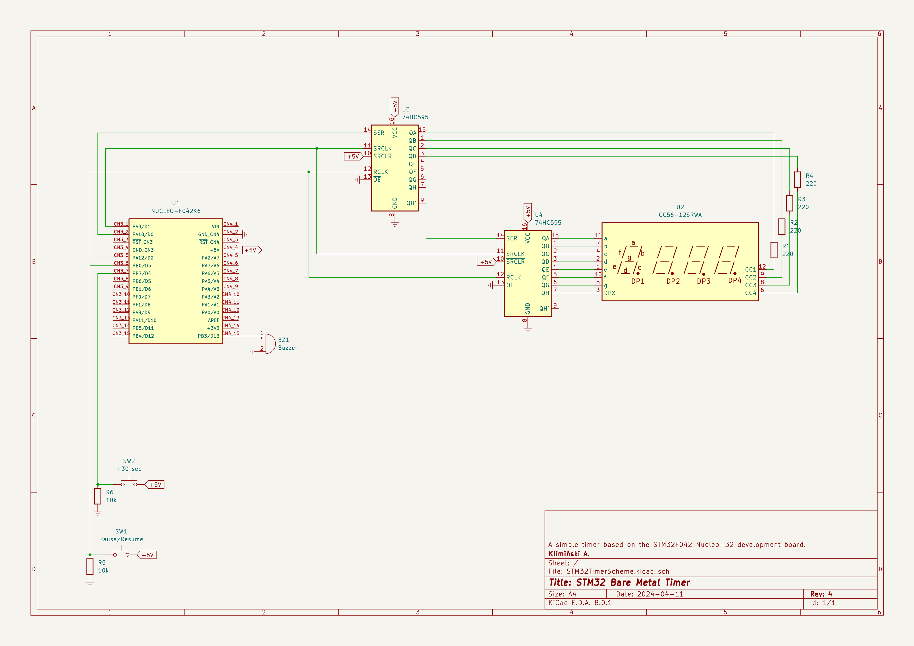
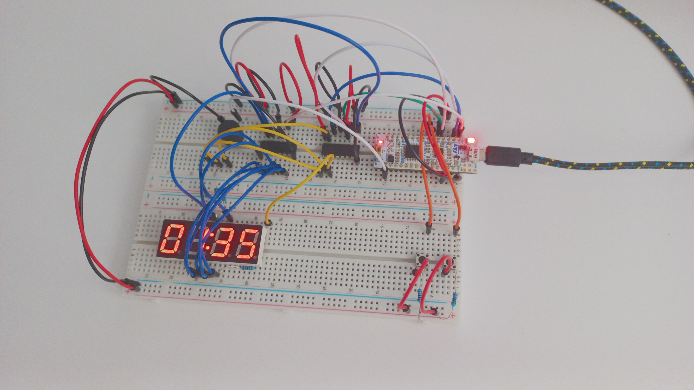

# STM32 Bare Metal Timer
A simple timer based on the STM32F042K6T6 Nucleo-32 microcontroller board.

## Functionality
Starts with 00:00 paused.

The device has two buttons: **"+30 sec"** and **"pause/resume"**.

**+30 sec** adds 30 seconds to the timer. Press the "pause/resume" button to start the countdown. Buzzer will produce the 1000 Hz tone for 100 ms every time a second passes. The moment after the 00:00 time was reached, buzzer will beep the 500 Hz and 1000 Hz tones interchangebly every 500 ms.

**pause/resume** toggles the pause mode. During the pause mode the buzzer is always quiet, even if it is 00:00 on the timer. Pause mode stops the countdown, to continue it, press the button again.

## Schematic


## Picture


## Compilation and uploading

### Prerequisites
 - `arm-none-eabi-gcc` compiler
 - `st-flash` utility

```
$ git clone https://github.com/GRAPHENE9932/stm32_bare_metal_timer.git
$ cd stm32_bare_metal_timer
$ mkdir build
$ cd build
$ cmake -DCMAKE_BUILD_TYPE=Release ..
$ make
$ make upload
```